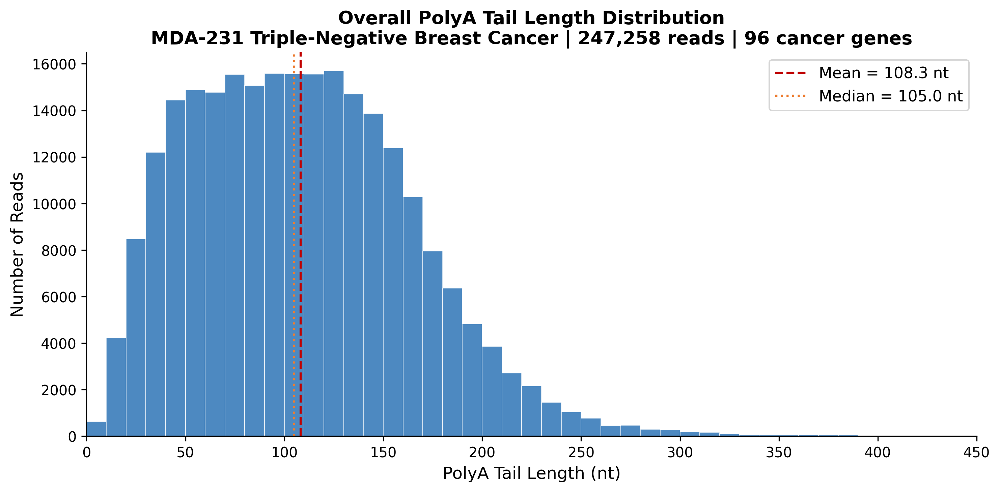
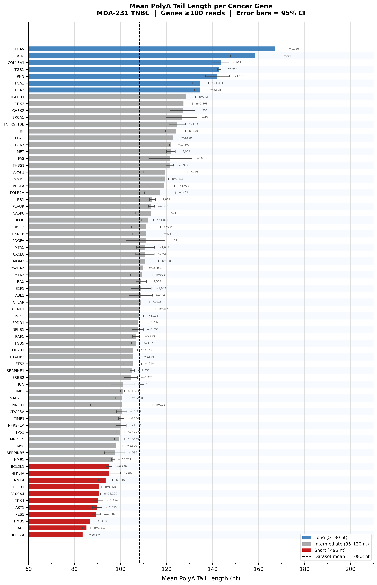
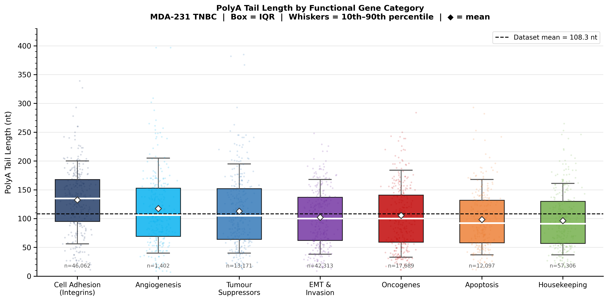
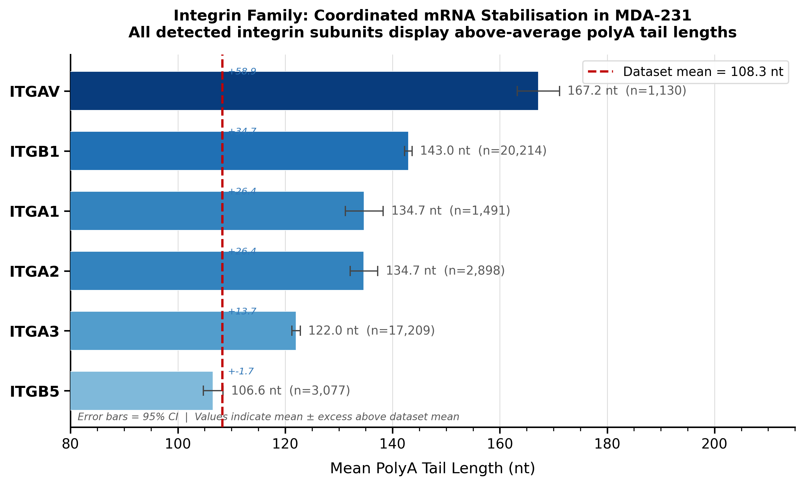
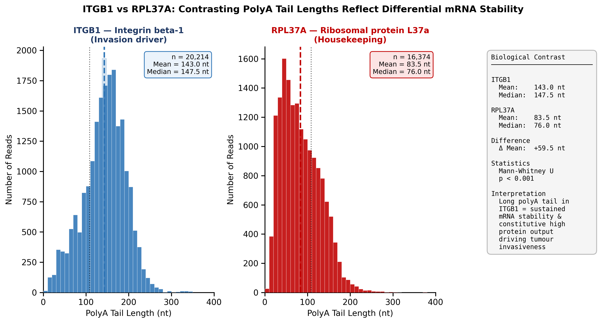

# PolyA Tail Length Landscape in Triple-Negative Breast Cancer
## Direct RNA Nanopore Sequencing | MDA-231 | 96 Cancer Genes

**Author:** Somrita Ghosh  
**Affiliation:** MSc Molecular Biology and Biotechnology, Queen's University Belfast (2024)  
**Institute:** Patrick G Johnston Centre for Cancer Research / Institute for Global Food Security  

---

## Overview

This repository contains the data, analysis code, and results from my MSc 
research project characterising polyA tail length regulation across 96 
cancer-associated genes in MDA-231 triple-negative breast cancer (TNBC) cells 
using Oxford Nanopore direct RNA sequencing.

Triple-negative breast cancer is the most aggressive breast cancer subtype, 
lacking targeted therapies and associated with poor prognosis. Understanding 
how cancer cells regulate mRNA stability through polyA tail length adds a 
post-transcriptional dimension to our understanding of TNBC gene expression 
that is not captured by standard RNA-seq approaches.

---

## Key Findings

- **247,258 individual polyA tail length measurements** across 88 of 96 
  cancer genes, generated by direct RNA sequencing on Oxford Nanopore MinION 
  using the SQK-RNA004 kit
- PolyA tail lengths span a **2-fold range** (RPL37A: 83.5 nt to ITGAV: 
  167.2 nt), demonstrating significant gene-specific mRNA stability regulation 
  (Kruskal-Wallis H=22,984, p<0.001)
- **All detected integrin family members** (ITGB1, ITGA1, ITGA2, ITGA3, 
  ITGAV, ITGB5) display above-average polyA tails, suggesting coordinated 
  post-transcriptional mRNA stabilisation drives constitutive integrin 
  expression and MDA-231 invasiveness
- **TGF-beta1 short polyA paradox:** TGFB1 displays one of the shortest 
  polyA tails (90.8 nt) despite being a key driver of epithelial-mesenchymal 
  transition and immunosuppression in TNBC — implying TGF-beta1 activity is 
  driven by transcriptional rather than post-transcriptional mechanisms
- **Oncogene divergence:** AKT1 (89.8 nt) and CDK4 (90.2 nt) show 
  unexpectedly short polyA tails despite being oncogenically active, while 
  CDK2 shows a long tail (127.4 nt), revealing differential post-transcriptional 
  regulation within the oncogenic kinase landscape
- Reference gene YWHAZ sits precisely at the dataset mean (109.8 nt), 
  validating technical reproducibility

---

## Figures











```
## Repository Structure

polya-tnbc-nanopore/
├── combined_pti_values.csv    # Per-read polyA tail lengths (96 genes)
├── polyA_analysis.R           # Full R analysis script
├── figures/                   # Generated figures (upload after running analysis)
├── README.md
└── LICENSE

```
## Methods Summary

| Parameter | Value |
|---|---|
| Cell Line | MDA-231 (Triple-Negative Breast Cancer) |
| Sequencing Platform | Oxford Nanopore MinION |
| Library Kit | SQK-RNA004 (Direct RNA Sequencing) |
| Basecaller | Dorado (modification-aware models) |
| Gene Panel | TaqMan Array Micro Fluidic Card 96a |
| Genes Detected | 88/96 (91.7%) |
| Total Reads | 247,258 |
| Statistical Test | Kruskal-Wallis, Mann-Whitney U, Pearson correlation |
| Analysis Language | R (ggplot2, dplyr, tidyr) |

RNA was extracted from MDA-231 cells using TRIzol, polyadenylated RNA was 
enriched, and libraries were prepared using the SQK-RNA004 direct RNA 
sequencing kit. Direct sequencing preserves native RNA without cDNA synthesis 
or amplification bias, enabling simultaneous measurement of polyA tail length 
and RNA base modifications (m6A, pseudouridine) from the same experiment.

---

## How to Reproduce This Analysis

**Requirements:**
- R version 4.0 or higher
- Packages: ggplot2, dplyr, tidyr, ggpubr, RColorBrewer

**Install packages:**
```r
install.packages(c("ggplot2", "dplyr", "tidyr", "ggpubr", "RColorBrewer"))
```

**Run analysis:**
```r
# Place combined_pti_values.csv in your working directory
source("analysis/polyA_analysis.R")
```

This will generate all five figures and the summary statistics CSV 
in your working directory.

---

## Data Description

`combined_pti_values.csv` contains per-read polyA tail length estimates 
(in nucleotides) for each of the 96 genes in the cancer panel. Each column 
is a gene, each row is an individual sequencing read. NA values indicate 
reads that could not be assigned to that gene. The file contains 20,214 rows 
and 96 columns.

---

## Biological Context

**Why polyA tail length matters in cancer:**  
The polyA tail is a key regulator of mRNA stability and translational 
efficiency. Longer tails stabilise mRNA, sustaining protein output. Shorter 
tails accelerate degradation. Until direct RNA nanopore sequencing, 
genome-wide polyA profiling required laborious indirect methods. This study 
demonstrates that gene-specific polyA regulation is measurable and 
biologically interpretable in a cancer context — with potential implications 
for understanding how TNBC cells maintain constitutive expression of 
invasion-driving proteins.

**Why TNBC:**  
TNBC lacks oestrogen receptor, progesterone receptor, and HER2 amplification, 
making it unresponsive to hormone therapies and HER2-targeted drugs. It 
relies heavily on chemotherapy and has poor prognosis. Understanding 
post-transcriptional gene regulation in TNBC may reveal new layers of 
therapeutic vulnerability.

---

## Future Directions

- Integration of m6A and pseudouridine modification data from the same 
  MinION sequencing run (Dorado modification-aware basecalling)
- Comparison with PEO1 and PEO4 ovarian cancer cell lines (data collected 
  during same MSc project)
- TCGA pan-cancer immune correlation analysis (CD8+ T cell infiltration 
  across 40 cancer types)
- Validation of polyA-stability relationships via PAT assays
- Biological replicates and comparison with normal breast epithelial cells

---

## Contact

**Somrita Ghosh**  
somritaghosh56@gmail.com  
linkedin.com/in/somrita-ghosh-014826211  
